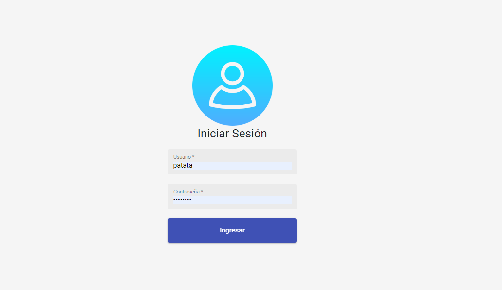
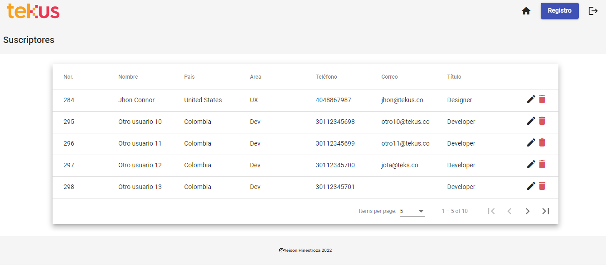
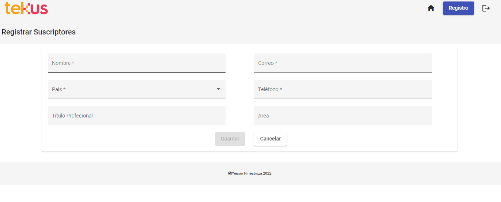

<h1 class="code-line" data-line-start=0 data-line-end=1>Patatas ToGo</h1>

### Este proyecto consiste en gestionar los suscriptores de la empresa “Patatas Subscribers ToGo”, que pagan un feed mensual para acceder a extraordinarias patatas cultivadas en Boyacá.

 
<h2>Login:</h2>

### Está dividido en dos módulos:

* **Suscriptores:** Éste les permite a los usuarios administradores previamente logueados lista todos los suscriptores, editar y eliminar suscriptores.

* **Registrar suscriptores:** Éste les permite a los usuarios administradores previamente logueados crear suscriptores.  

## Información técnica:
<table style="border-collapse: collapse; width: 0%; height: 104px;" border="1">
<tbody>
<tr style="height: 18px;">
<td style="width: 25%; height: 18px; text-align: center;"><strong>Herramienta</strong></td>
<td style="width: 35.9434%; text-align: center; height: 18px;"><strong>Versi&oacute;n&nbsp;</strong></td>
<td style="width: 311.507%; height: 18px; text-align: center;"><strong>Descripci&oacute;n</strong></td>
</tr>
<tr style="height: 18px;">
<td style="width: 25%; height: 18px;">Angular</td>
<td style="width: 35.9434%; height: 18px; text-align: center;">11</td>
<td style="width: 311.507%; height: 18px;">Framework principal</td>
</tr>
<tr style="height: 18px;">
<td style="width: 25%; height: 18px;">Material</td>
<td style="width: 35.9434%; height: 18px; text-align: center;">14.2.2</td>
<td style="width: 311.507%; height: 18px;"> Componentes de interfaz de usuario</td>
</tr>

<tr style="height: 18px;">
<td style="width: 25%; height: 18px;">

Bootstrap

</td>
<td style="width: 35.9434%; height: 18px;">5.2.2</td>
<td style="width: 311.507%; height: 18px;">Dise&ntilde;o web</td>
</tr>
<tr>
<td style="width: 25%;">

Angular CLI

</td>
<td style="width: 35.9434%;">14.2.2</td>
<td style="width: 311.507%;">Entorno en tiempo de ejecuci&oacute;n</td>
</tr>
</tbody>
</table>
  

# For Developers

This project was generated with [Angular CLI](https://github.com/angular/angular-cli) version 14.2.2.

## Development server

Run `ng serve` for a dev server. Navigate to `http://localhost:4200/`. The application will automatically reload if you change any of the source files.

## Code scaffolding

Run `ng generate component component-name` to generate a new component. You can also use `ng generate directive|pipe|service|class|guard|interface|enum|module`.

## Build

Run `ng build` to build the project. The build artifacts will be stored in the `dist/` directory.

## Running unit tests

Run `ng test` to execute the unit tests via [Karma](https://karma-runner.github.io).

## Running end-to-end tests

Run `ng e2e` to execute the end-to-end tests via a platform of your choice. To use this command, you need to first add a package that implements end-to-end testing capabilities.

## Further help

To get more help on the Angular CLI use `ng help` or go check out the [Angular CLI Overview and Command Reference](https://angular.io/cli) page.
